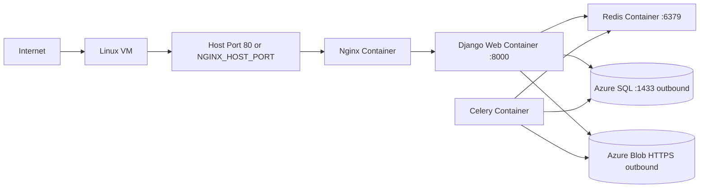

# Task-Orchestrator System Design and Developer Documentation

This document is written for:
- Backend developers
- DevOps engineers
- Freshers/students who are learning containerized Django systems

It explains the platform from three architecture viewpoints:

1. Entire project architecture
2. Django project architecture
3. Container communication architecture on a VM

It also covers CI/CD, `Dockerfile`, `docker-compose.yml`, communication flow, and firewall troubleshooting.

---

## 1) Entire Project Architecture (Macro Design)

### 1.1 Purpose

Task-Orchestrator provides APIs where authenticated users can:
- Register/login
- Submit tasks with metadata/files
- Track task status
- Trigger background processing (Celery)

### 1.2 High-Level Components

```mermaid
flowchart LR
    U[Client: Browser/Postman] --> N[Nginx Reverse Proxy]
    N --> W[Django + Gunicorn (web)]
    W --> DB[(Azure SQL or SQLite)]
    W --> B[(Azure Blob Storage)]
    W --> R[(Redis Broker)]
    C[Celery Worker] --> R
    C --> DB
    C --> B
```

### 1.3 Request-to-Execution Journey

1. Client sends request to Nginx.
2. Nginx forwards to Django (`web:8000`).
3. Django authenticates user via JWT.
4. Django stores task metadata in DB.
5. Django enqueues async task into Redis.
6. Celery consumes job from Redis.
7. Worker processes task and updates DB / file outputs.
8. Client polls task endpoints for latest status.

### 1.4 Reliability and Production Behaviors

- Health checks for `web` and `redis` in Compose.
- `depends_on` with health conditions to order startup.
- Nginx decouples public traffic from Django internals.
- Celery failures do not crash API creation flow (best-effort enqueue behavior).

---

## 2) Django Project Architecture (Application Design)

### 2.1 Django App Structure

- `users` app: registration, JWT login response enrichment, profile endpoint.
- `tasks` app: task domain model, API viewset, filters, dashboard metrics, cancel action.
- `task_manager` project package: settings, root URL routing, Celery setup, WSGI/ASGI.

### 2.2 Layered API Design

```mermaid
flowchart TD
    A[Request /api/*] --> B[URL Router]
    B --> C[View / ViewSet]
    C --> D[Serializer]
    D --> E[Model]
    E --> F[(Database)]

    C --> G[Celery delay()]
    G --> H[(Redis)]
    H --> I[Celery Worker]
    I --> E
```

### 2.3 Authentication and Authorization

- JWT authentication is configured as the default DRF auth mechanism.
- Default permission requires authenticated users.
- Registration endpoint is explicitly open.
- Task querysets are user-scoped to prevent cross-user data access.

### 2.4 Task Domain Model

The `Task` model captures:
- Identity: UUID primary key
- Ownership: foreign key to custom `User`
- Lifecycle: `PENDING`, `PROCESSING`, `COMPLETED`, `FAILED`, `CANCELLED`
- Timing: created/started/completed timestamps
- Payload: JSON input/output + optional input/output files
- Operational fields: progress, retry count, error details

Indexes support common access patterns:
- Per-user listing
- Status filters
- Type/status combinations
- Priority/status recency views

### 2.5 Django Communication Internals

**Synchronous path (API):**
- DRF router maps URL to `TaskViewSet`.
- `TaskSerializer` validates and maps payload.
- `perform_create()` saves task and attempts async enqueue.

**Asynchronous path (worker):**
- Celery worker listens to Redis broker URL.
- `process_task_file(task_id)` executes in background.
- Worker can update task records or output artifacts.

### 2.6 Storage Strategy

- Database:
  - Azure SQL when `USE_AZURE_SQL=True` and required DB env vars exist.
  - Automatic fallback to SQLite in missing/misconfigured cases.
- File storage:
  - Azure Blob-backed storage is enabled when Azure storage credentials/connection string are present.

---

## 3) Container Communication Architecture on VM (Runtime/Infra Design)

### 3.1 Runtime Topology Inside VM



### 3.2 Docker Network Behavior

All services in `docker-compose.yml` join the default Compose network and resolve each other by service name:
- `web` reaches Redis via `redis:6379`
- Nginx proxies to `http://web:8000`
- Celery shares same image/build context as `web`

### 3.3 Communication Flows (Container-to-Container)

1. **Client → Nginx:** incoming HTTP on host port.
2. **Nginx → Web:** reverse proxy to internal service name `web`.
3. **Web → Redis:** queue background jobs.
4. **Celery → Redis:** consume queued jobs.
5. **Web/Celery → Azure SQL:** persist and fetch relational data.
6. **Web/Celery → Azure Blob:** file read/write operations.

### 3.4 VM Firewall and NSG Guidance

Open inbound:
- `80` for HTTP (or custom published port)
- `443` for HTTPS (recommended in production)

Allow outbound:
- `1433` to Azure SQL endpoint
- `443` to Azure Blob and package endpoints

Keep private/closed:
- Redis port from public internet
- Internal container-only ports
- Database should never be world-exposed

---

## 4) Deep Dive: `docker-compose.yml`

### 4.1 Service Definitions

- **redis**
  - image: `redis:7-alpine`
  - healthcheck using `redis-cli ping`

- **web**
  - built from project `Dockerfile`
  - startup command runs migrations then launches Gunicorn
  - exposes port `8000` inside Compose network
  - healthcheck calls `http://127.0.0.1:8000/healthz`

- **celery**
  - same image as `web`
  - runs Celery worker process
  - depends on healthy `redis` and `web`

- **nginx**
  - image: `nginx:1.27-alpine`
  - binds host `${NGINX_HOST_PORT:-80}` to container `80`
  - mounts `nginx/default.conf`

### 4.2 Environment Model

`x-app-env` anchor centralizes env vars shared by `web` and `celery`:
- Django runtime settings (`ENV`, `DEBUG`, `SECRET_KEY`)
- DB and Azure values
- Celery broker/backend URLs

This improves consistency and reduces duplication errors.

---

## 5) Deep Dive: `Dockerfile`

### 5.1 Build Strategy

- Base image: `python:3.11-slim` for smaller footprint.
- Installs compilation + ODBC dependencies.
- Adds Microsoft package feed and installs `msodbcsql18` (Azure SQL support).
- Installs Python dependencies from `requirements.txt`.
- Copies repository source into image.

### 5.2 Runtime Strategy

- Default command:
  - run migrations (`--fake-initial`)
  - start Gunicorn bound to `0.0.0.0:8000`
- Includes image-level healthcheck hitting `/healthz`.

This design allows same image to be reused by both `web` and `celery` services.

---

## 6) Deep Dive: CI/CD Pipeline (`Jenkinsfile`)

### 6.1 Pipeline Stages

1. **Prepare workspace**
   - handles stale root-owned files from prior Docker runs
   - cleans workspace

2. **Checkout**
   - checks out source into workspace and build-specific directory

3. **Build Containers**
   - uses `docker-compose` or `docker compose`
   - executes compose build with `--pull`

4. **Run Tests**
   - runs Django test suite through Compose-run web container
   - injects CI-safe env values

5. **Deploy**
   - injects secrets from Jenkins credentials
   - validates required env values
   - resolves nginx host-port conflicts automatically if needed
   - starts stack and validates web health status

### 6.2 Deployment Safety Controls

- Required secret validation before deploy.
- Health-based readiness loop (inspect container health status).
- Recent logs printed when health check fails.

### 6.3 Practical CI/CD Outcomes

- Repeatable deployments.
- Faster failure visibility.
- Reduced manual SSH-based ops burden.

---

## 7) Communication and Troubleshooting Playbook

### 7.1 Quick Connectivity Checks

```bash
# Check all containers
docker compose ps

# Test public endpoint from VM
curl -i http://127.0.0.1:${NGINX_HOST_PORT:-80}/healthz

# Verify web container can answer health endpoint
docker compose exec web python -c "import urllib.request;print(urllib.request.urlopen('http://127.0.0.1:8000/healthz').status)"

# Check Redis reachability
docker compose exec web python - <<'PY'
import redis
r = redis.Redis(host='redis', port=6379, db=0)
print(r.ping())
PY
```

### 7.2 Firewall Troubleshooting for Azure SQL (`HYT00` timeouts)

If Django/Celery cannot connect to Azure SQL:

1. Confirm env values: `DB_HOST`, `DB_PORT=1433`, `DB_NAME`, `DB_USER`, `DB_PASS`.
2. Confirm `USE_AZURE_SQL=True` only when Azure SQL is intended.
3. Validate outbound connectivity from VM:
   ```bash
   nc -vz <azure-sql-host> 1433
   ```
4. Add VM outbound IP to Azure SQL firewall allowlist.
5. Verify NSG/firewall rules permit outbound 1433.
6. Ensure ODBC TLS settings are compatible with Azure SQL policy.

### 7.3 Nginx and Port Conflict Troubleshooting

Symptoms:
- Nginx container fails to start
- Jenkins deployment logs mention bind error on desired port

Checks:
```bash
ss -ltnp
lsof -iTCP -sTCP:LISTEN -n -P
docker compose logs nginx --tail=200
```

Actions:
- Set `NGINX_HOST_PORT` to an available port.
- Keep Jenkins and app on distinct host ports.
- Restart stack: `docker compose up -d --remove-orphans`.

---

## 8) Improvements (Next Iterations)

For industry-grade maturity, consider adding:

- **Observability:** structured logs + centralized log shipping + metrics.
- **Security:** HTTPS termination, secret manager, image scanning, SAST/DAST.
- **Scalability:** separate worker queues, autoscaling strategy, caching policy.
- **Resilience:** retries/backoff for external calls, dead-letter queue patterns.
- **Governance:** architecture decision records (ADRs), API versioning policy.

---

This order builds strong understanding from API basics to production operations.